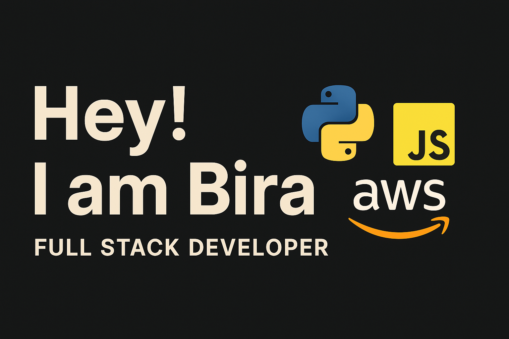

- 👋 Hi, I’m Birathiban
- 👀 Full Stack Developer with 15+ years in software development, including over 10 years of expertise in **Python, Node.js, PHP, JavaScript, SQL, HTML, CSS**, and frameworks like **Express.js, React, Laravel, Flask, FastAPI, Django**. Proficient in cloud services like AWS with 6+ years of hands-on practice, and experienced with NoSQL databases. I also have a year of experience in machine learning and data science. My work spans industries such as Banking, Property, Healthcare, and Bookings, allowing me to deliver technical solutions with a deep understanding of business domains.

<!---
bthiban/bthiban is a ✨ special ✨ repository because its `README.md` (this file) appears on your GitHub profile.
You can click the Preview link to take a look at your changes.
--->

